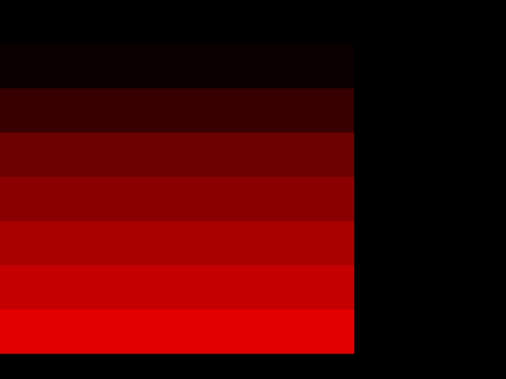
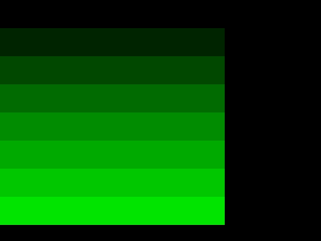
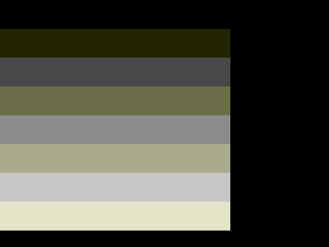
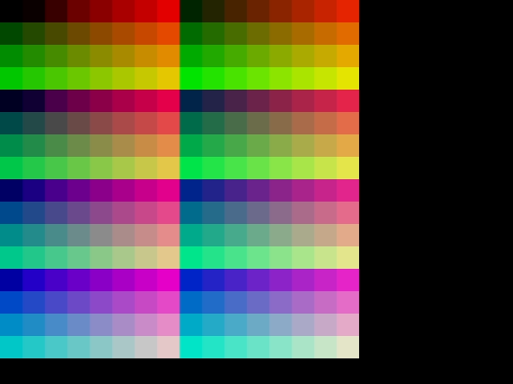
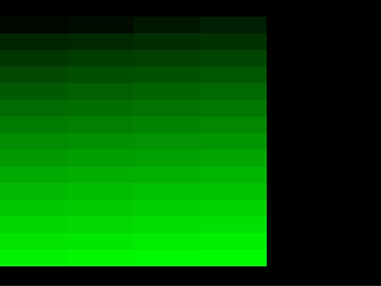
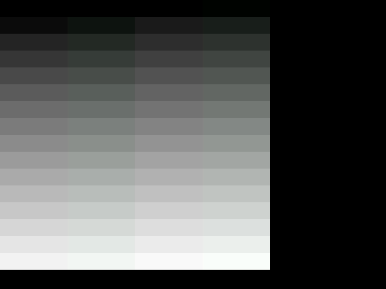

<!-- SPDX-License-Identifier: MIT -->
<!-- SPDX-FileCopyrightText: Copyright 2025 Sam Blenny -->
# Fruit Jam Color Checker

This makes color swatch patterns for comparing Fruit Jam DVI output to colors
on a regular computer.

This code was developed and tested on a pre-release revision B Fruit Jam
prototype board using CircuitPython 10.0.0-alpha.6 from the circuitpython.org
[Fruit Jam downloads](https://circuitpython.org/board/adafruit_fruit_jam/) page.
Things may change by the time CircuitPython 10.0.0 is released.

## Screen Captures at 8-bit Color Depth

These screenshots were taken with an EVGA XR1 Lite into macOS on a display set
for sRGB. The CircuitPython code was set to use `color_depth=8` for the
`framebufferio.FramebufferDisplay`. The result is that the palette colors get
quantized from 256 step ramps into just 4 or 8 values (RGB332). As you can see,
the color selection is okay for shades of green, blue, red, and magenta. But,
the grays and other hues aren't that great.

### Red (3 bits, 8 values)

### Green (3 bits, 8 values)

### Blue (2 bits, 4 values)

### Gray (8 values but weird)

This one looks strange because blue is not able to change at the same rate as
red and green.

### RGB332 Colors

## Screen Captures at 16-bit Color Depth

These screenshots were taken on the same setup except for `color_depth=16`. The
result is that the palette colors get quantized from 256 step ramps into 32 or
64 values (RGB565). As you can see, this looks a lot smoother than the 8-bit
version. In particular, the grays look fine this time.

### Red (5 bits, 32 values)

### Green (6 bits, 64 values)

### Blue (5 bits, 32 values)

### Gray (64 values)

### RGB332 Colors

These look about the same as the 8-bit version, but the gray values are better.
It would be possible to pick many other 256 position palettes from the 65536
available colors in 16-bit color depth mode, but I was lazy and just copied the
same thing that I used for 8-bit mode.

